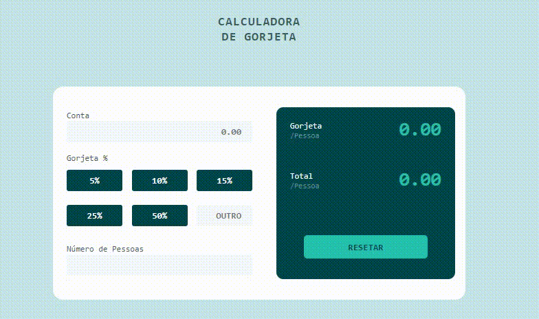

# Sobre

Primeiro desafio realizado para o site Frontend Mentor

A ideia era fazer uma calculadora que calcula o valor da gorjeta em tempo real (sem precisar pressionar qualquer botão)

## Linguagens

- HTML
- CSS
- JavaScript

## Preview

Codepen: https://codepen.io/fabioguedesj/pen/porwyyX

    

